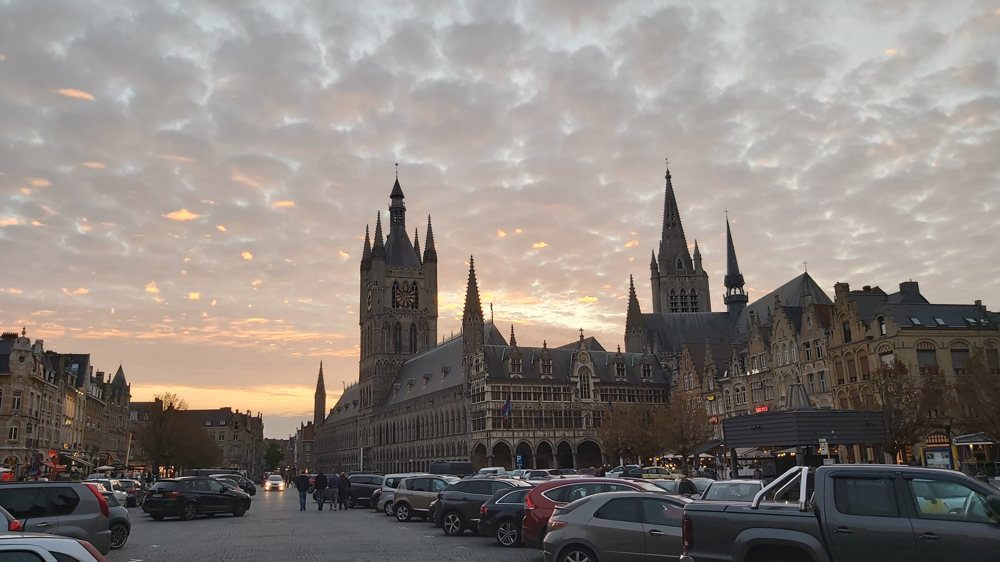

= gogray

Go program to convert an image to grayscale using various techniques

== Test Input

.std

== Test Output

.std
image:std.png[std]

.avg
image:avg.png[std]

.red
image:red.png[std]

.green
image:green.png[std]

.blue
image:blue.png[std]
